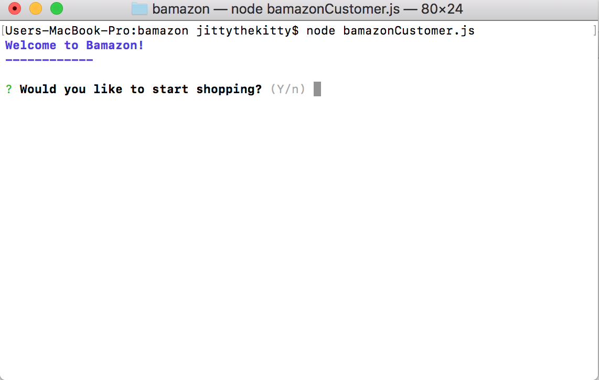
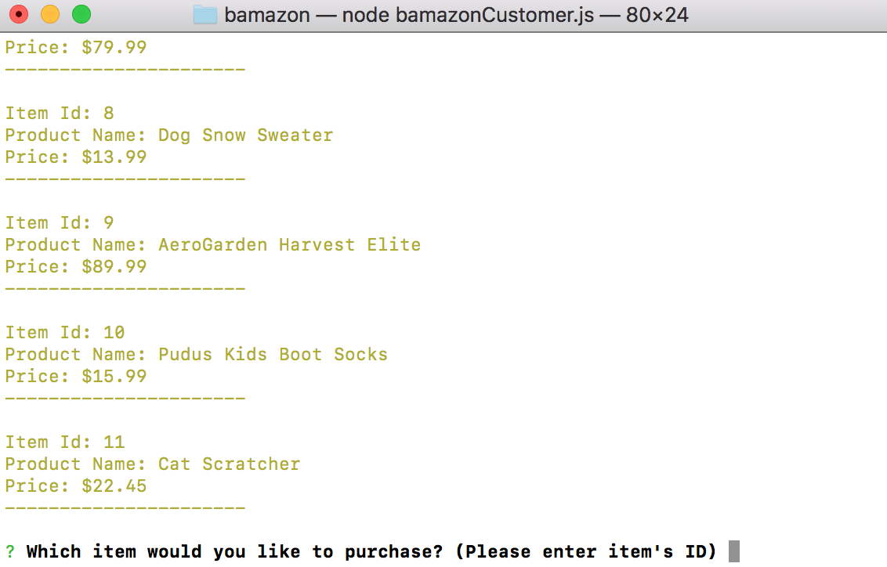
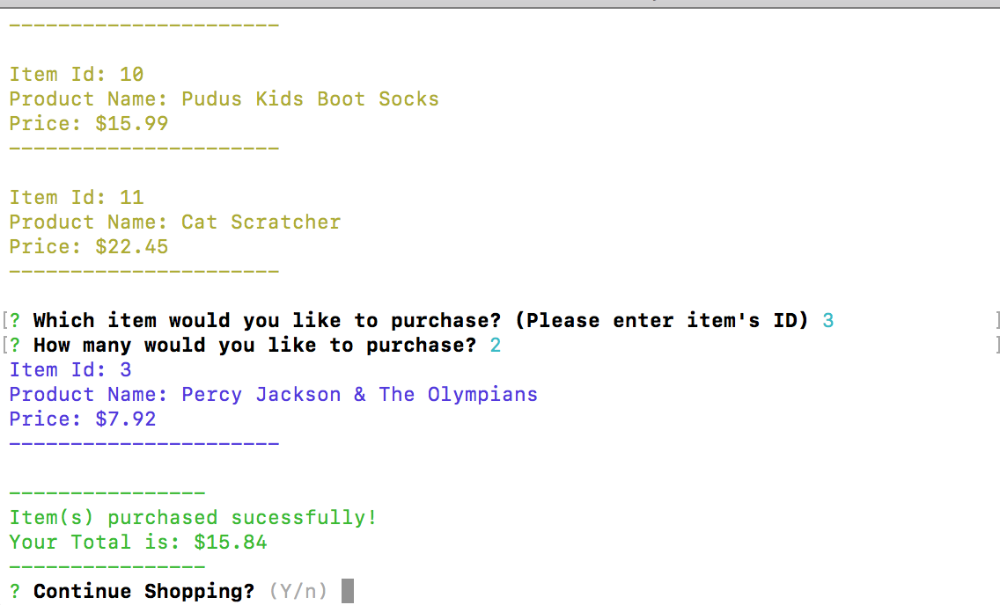
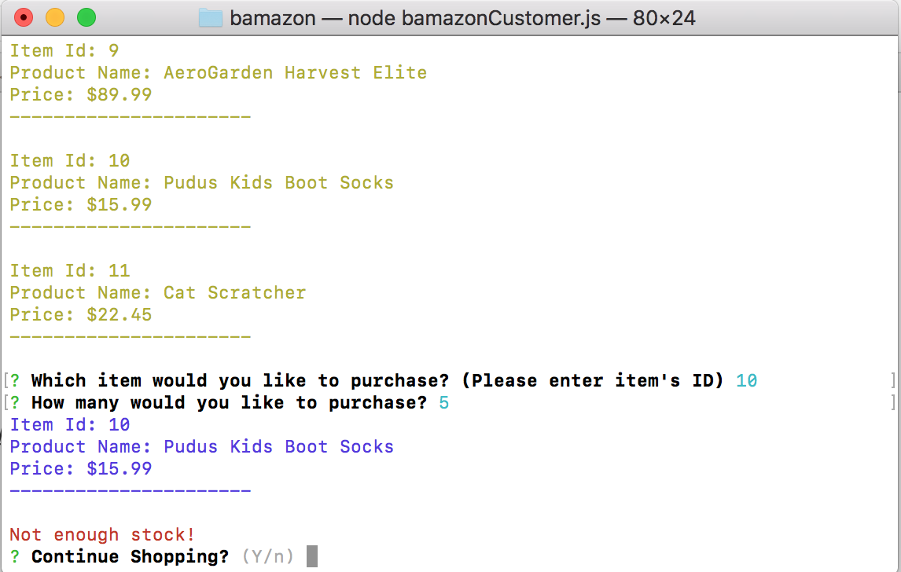
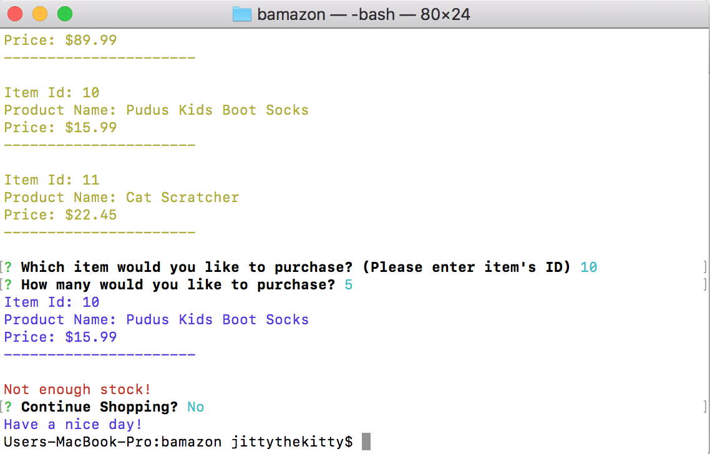
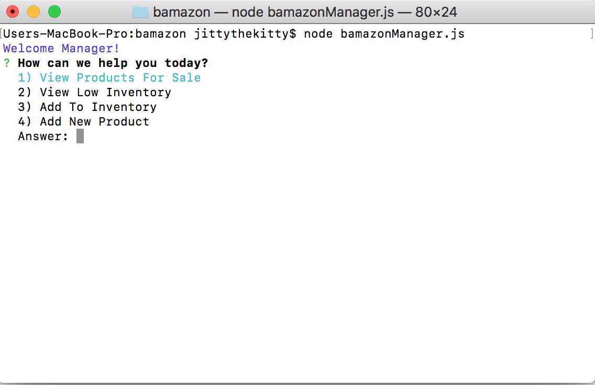
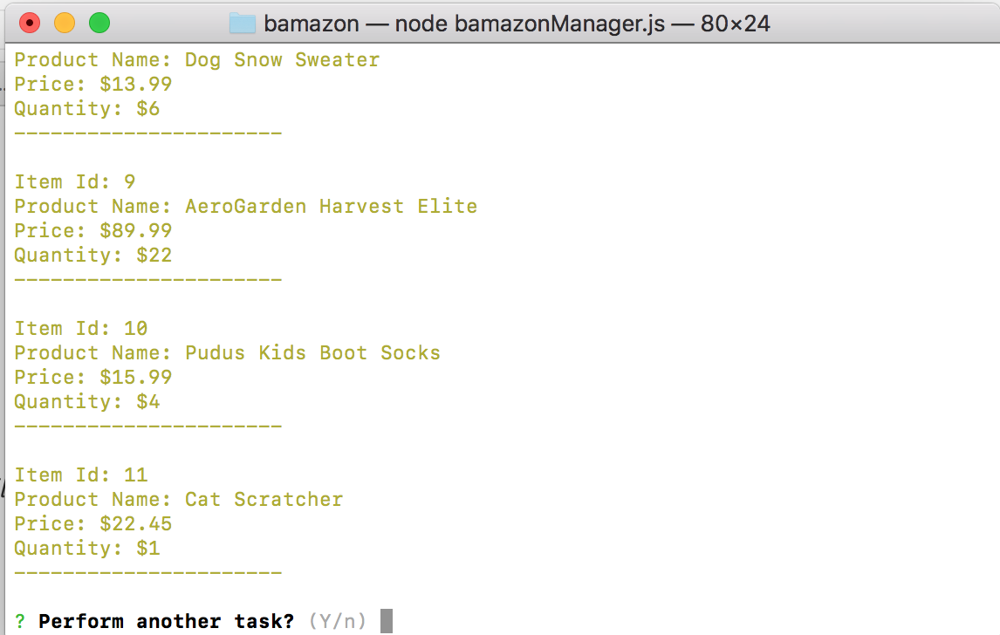
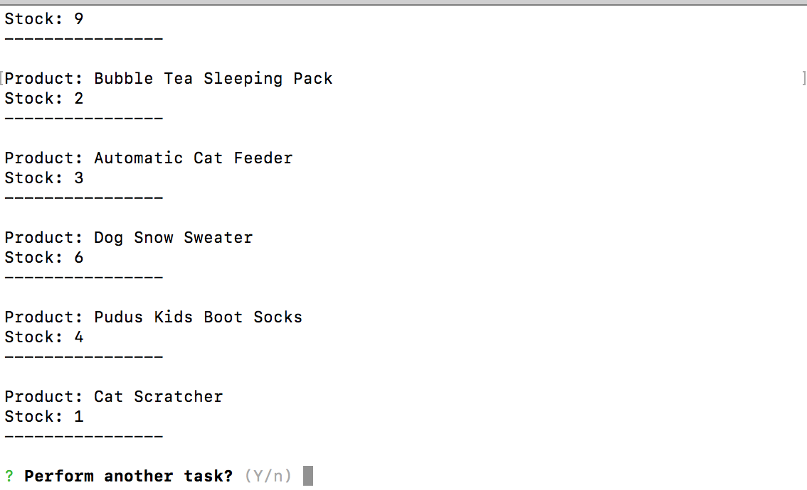
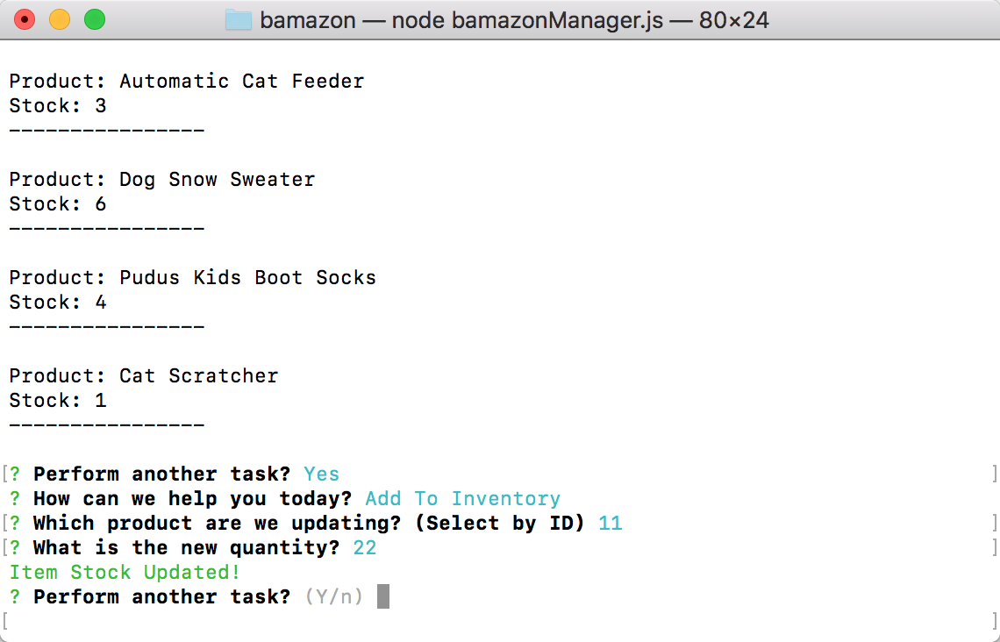
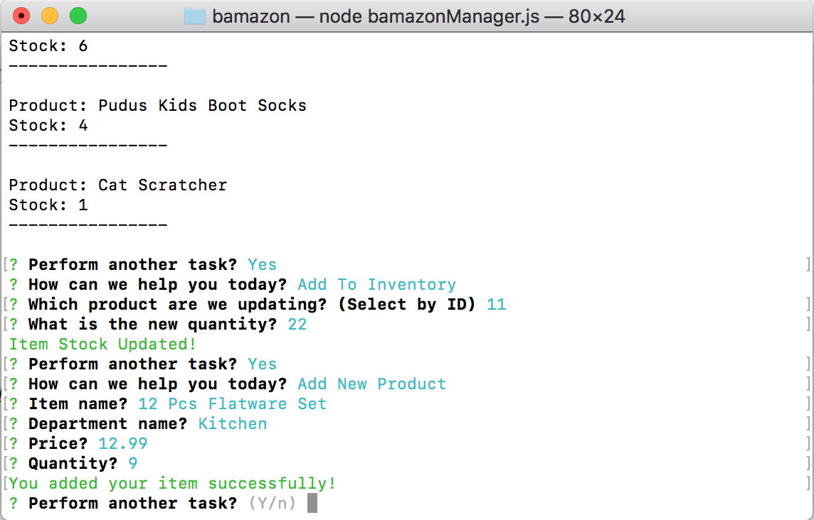

# bamazon
A store front application utilizing Javascript, Node.js, and mysql

Requires NPM packages inquirer, inquirer-confirm, dotenv, mysql, and chalk.

#bamazonCustomer.js application allows user to purchase items from a database

#bamazonManager.js applications allows updates to the database, like updating stock, searching by low stock and adding items

